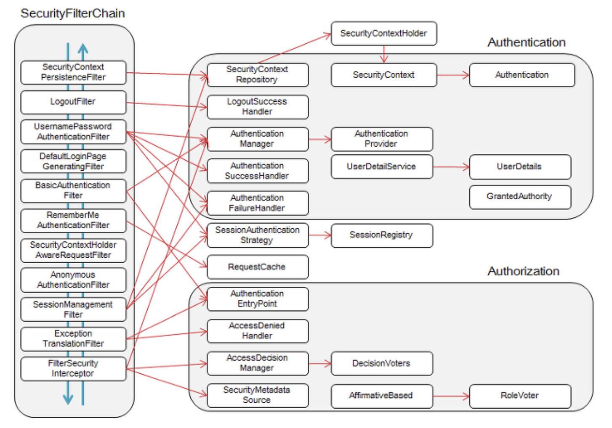

## Spring Security

### 웹 애플리케이션 주요 보안 요소

#### 인증 : 사용자가 누구인지 확인하는 절차

- 사용자의 신원을 확인하는 과정
  - 아이디/패스워드 기반 로그인
  - OAuth2.0 프로토콜을 통한 Social 인증
- 애플리케이션은 **인증 영역**과 **익명 영역**(인증되지 않은 영역)으로 나눌 수 있음 
  - 인증 영역 - 사용자의 개인정보를 확인하고 수정할 수 있음
  - 익명 영역 - 사용자의 신원과 무관한 기능들
    - 사용자의 민감 정보를 노출하지 않아야 함
    - 시스템의 상태를 변경하거나 데이터를 관리할 수 있는 기능을 제공하지 않아야 함

#### 인가 : 사용자가 요청하는 요청(Request)을 실행할 수 있는 권한을 가졌는지 권한 여부를 확인하는 절차

- 적절한 권한이 부여된 사용자들만 특정 기능 수행 또는 데이터 접근을 허용함
- 주어진 권한을 넘어서는 기능 수행은 민감 데이터 유출 등 보안사고 발생 가능성이 높음

#### 크리덴셜(Credential) 보안

- 민감정보(연락처, 결제정보, 비밀번호 등)을 보호하는 것은 항상 최우선 순위로 두어야 하는 일
- 민감정보를 **암호화**하지 않고, 일반 텍스트로 저장하는 것은 매우 위험함 -> 2차 피해 유발 가능

#### 전송 레이어 보안

- SSL 보호 적용
- SSL(Secure Socket Layer) : 네트워크 상에 존재하는 어떤 위협들로부터 데이터를 보호하는 프로토콜
- SSL을 사용하여 클라이언트와 서버 간의 데이터를 암호화하거나 인증함으로써 중요 데이터를 보호함

### 애플리케이션 보안 관련 다양한 기능 제공

- Spring Boot 웹 애플리케이션에 적용 가능, 각 상황에 보안을 적용할 수 있음
- 사용자 인증 및 인가 처리
- 필요에 따라 커스터마이징
- 다양한 확장 기능과 자연스러운 통합
  - Spring Session (세션 클러스터 기능 추상화 제공)
  - Spring Security Oauth (Oauth 1a, Oauth2 인증 프로토콜 제공)

## 실습

- 의존성

  - **spring-boot-starter-security** — spring security 모듈

  - **spring-security-test**  — security 테스트 모듈

  - **thymeleaf-extras-springsecurity5 —** thymeleaf spring security 확장 모듈
    - Thymeleaf View 에서 Spring Security 관련 기능(인증 정보 확인 등)을 쉽게 사용 가능

- @EnableWebSecurity 어노테이션, WebSecurityConfigurerAdapter 클래스
  - WebSecurityConfigurerAdapter 추상 클래스를 상속하는 구현체에 @EnableWebSecurity 어노테이션을 추가
  - @EnableWebSecurity 어노테이션 : 스프링 시큐리티 사용을 위한 어노테이션
  - 기본적인 Spring Security 설정이 자동으로 추가되며, 개별 설정을 override 할수 있음

- WebSecurity 클래스 : 필터 체인 관련-Spring Security 관련- 전역 설정
  - ignoring()
    - Spring Security 필터 체인을 적용하고 싶지 않은 리소스에 대해 설정
    - 일반적으로 정적 리소스(html, css, js 등)을 예외 대상으로 설정함
    - 불필요한 서버 자원 낭비를 방지함
    - Filter Chain을 굳이 적용시킬 필요가 없는 path에 적용시킬 경우 비효율적이다 -> 필요한 곳에만 적용(필요한 곳이 아니면 적용X)

> 이미지 출처 : https://atin.tistory.com/590

- HttpSecurity 클래스 : 세부적인 웹 보안 기능 설정을 처리할 수 있는 API 제공 (스프링 시큐리티 규칙)

- 기본 로그인 계정을 추가할 때 password 설정 시 주의할 점
  - Spring Security 5 에서는 DelegatingPasswordEncoder 클래스가 기본 PasswordEncoder로 사용됨
  - DelegatingPasswordEncoder 클래스는 해시 알고리즘 별로 PasswordEncoder를 제공하는데, 선택을 위해 패스워드 앞에 prefix를 추가함
  - default PasswordEncoder : bcrypt
  - 해시 알고리즘을 변경하거나, 강력한 해시 알고리즘을 사용하여 password를 업그레이드 할 수 있도록 함

