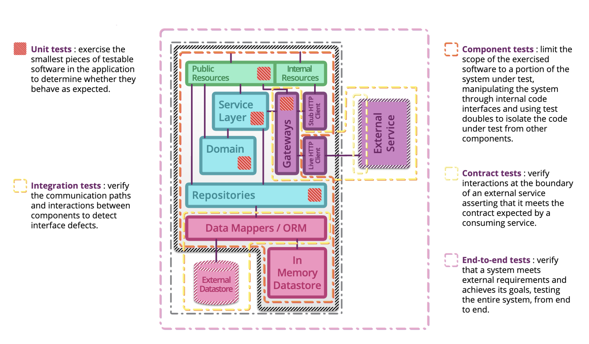

> [이미지 출처](https://martinfowler.com/articles/microservice-testing/#conclusion-summary)

## 단위 테스트

단위 테스트는 실행이 빠르다. 고립해서 테스트한다.

단위 - 하나의 클래스를 지칭한다.

테스트 하고자 하는 대상 - SUT

SUT는 혼자 일을 하지 않고 다른 객체와 협력 관계를 가지고, 의존 관게에 있는 다른 객체들이 존재하게 된다. 협력 관계자들을 같이 묶어서 테스트하지 않고 `테스트 더블` 로 대체해서 SUT 만을 진행하는 것을 단위 테스트라고 한다.

Given - 전제조건

When - 특정 상황(메서드)

Then - 결과 확인

### 테스트 더블

의존 구성요소를 사용할 수 없을 때 테스트 대상 코드와 상호작용하는 객체를 말한다.

가짜 객체 - 스텁 / 목 객체

### 단위 테스트를 작성하는 목적

- 코드가 지속적으로 변경될 때 오류가 발생할 수 있는데, 테스트를 통해 그러한 문제를 방지할 수 있다.
- 기능 명세서가 될 수 있다.

## 통합 테스트

다른 객체와 연동이 잘 되는지 테스트하는 것이다.

단위 테스트가 끝나면 모듈 간에 연동이 잘 되는지 테스트한다.

외부 시스템과의 연동을 테스트하는 것도 포함한다.

시스템 전체를 보는 것을 End-to-end 테스트

## JUnit

- 매 단위 테스트마다 테스트 클래스의 인스턴스가 생성되어 독립적인 테스트가 가능하게 한다.
- 어노테이션을 제공해서 테스트 라이프 사이클을 관리하게 해주고 테스트 코드를 간결하게 작성하도록 지원해준다.
- 테스트 러너를 제공해서 테스트 코드를 쉽게 실행하게 해준다.
- assert 같은 메서드를 제공해주고, 테스트 케이스의 수행 결과를 판별하게 해준다.

JUnit4 - 확장성이 떨어진다.

JUnit5 - 확장성있게 아키텍처가 개선되었다.

### JUnit Platform

JVM 상에 테스팅 프레임워크를 런칭하기 위한 근간을 제공한다. 테스트를 발견하고 테스트 계획을 생성하는 TestEngine 인터페이스를 가지고 있고, TestEngine을 통해서 테스트를 발견하고 실행하고 결괄르 보고한다.

### JUnit Jupiter

jupiter-engine : JUnit5용 TestEngine 구현체

jupiter-api를 사용해서 작성한 테스트 코드를 발견하고 실행한다.

### JUnit Vintage

vintage-engine : JUnit4용 TestEngine 구현체

JUnit4 버전으로 작성한 테스트 코드를 실행할 때 사용한다.

## Mock Object

Mock Object는 행위 검증(behavior verification)을 사용하고, stub을 포함한 다른 대역들은 상태 검증(state verification)을 사용한다.

목 객체는 호출에 대한 기대를 명세한다. 내용에 대해 기술된 객체 - 행위

stub이 실제 가짜 객체 - dummy, fake - 실제 동작하는 것처럼 보이게 만드는 객체

- 상태 검증 : 메소드가 수행된 후 객체의 상태를 확인하여 올바르게 동작했는지를 확인하는 검증법
- 행위 검증 : 메소드의 리턴값으로 판단할 수 없는 경우, 특정 동작을 수행하는지 확인하는 검증법

Test Framework - **Mockito**, JMock, EasyMock

## Spring의 JUnit5 지원

스프링 컨테이너 없이 단위 테스트를 어떻게 해야할지

테스트 시 IoC 컨테이너를 위한 Spring TestContext Famework를 제공한다. 캐시 기능이 있어서 단위 테스트 시 같은 내용의 컨테이너를 재사용해서 빠르게 실행하게 한다.

@ContextConfiguration 

- 테스트에 사용할 ApplicationContext를 로드하는 데에 어떤 configuration 파일들을 사용할지 명시한다.
- 별도로 작성하지 않으면 테스트 클래스 내부에서 @Configuration이 달린 static class를 찾는다.

@ExtendWith(SpringExtension.class) : 상호작용할 수 있게 해준다.

@SpringJunitConfig : @ExtendWith와 @ContextConfiguration 을 합친 어노테이션이다.