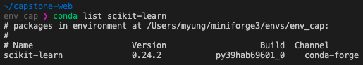
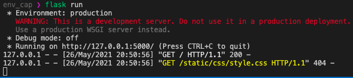

이번 학기에 캡스톤디자인 프로젝트를 진행하면서 만든 결과물들을 보여주기 위해 간단한 서버를 만들게 되었습니다.
> 구글링을 통해 기본 예제 소스와 다른 블로그를 참고하여 개발했습니다.

데이터 전처리 과정과 머신러닝 모델은 파이썬으로 작성했기 때문에 당연하게도(?) 파이썬을 기반으로 한 웹 프레임워크를 선택하였습니다. 한 페이지 정도로 보여줄 것이기 때문에 경량화된 웹 프레임워크인 Flask를 선택했습니다.
> 대부분 Django를 선택하지만 굳이 Django로 구현해야 할 특별한 이유가 없다고 생각했습니다. (사실 Flask 예제를 먼저 봐버렸,,,)

## 1. 가상환경 구축

프로젝트용 폴더를 만들고 가상 환경을 만들었습니다.
찾아보니 가상 환경이 여러 가지가 있는데 대표적으로 두 가지를 놓고 선택한다고 합니다.
- virtualenv
- conda

처음에는 virtualenv로 가상 환경을 구축하려고 했습니다. 그런데 virtualenv 가상 환경에서 scikit-learn 설치 오류로 인해 설치를 할 수 없었습니다. 어떤 이유 때문인지 몰라서 구글링을 해본 결과, 해당 문제와 관련한 비슷한 내용을 발견했습니다.
- Apple Silicon의 arm64에서 패키지를 설치할 때 Intel용과 Arm 용이 혼재되는 우려
- 여러 가지 패키지들을 설치하는 과정에서 의존성 문제가 발생

이런 이유로 제 랩탑이 M1 맥북인데 그래서 설치가 안된거 같다는 추측을 해봅니다.

[scikit-learn 설치 페이지](https://scikit-learn.org/stable/install.html)를 보면, 2021년 1월 기준으로 M1에 사이킷런을 설치하기 위해서 miniforge를 사용해야 한다고 합니다.

다른 블로그도 참고해서 conda 가상 환경을 구축했습니다.

## 2. 패키지 설치

패키지 설치는 가상 환경 상에서 진행합니다. 가상 환경을 'env_cap' 라는 이름으로 생성하

- flask
```shell
(env_cap) $ conda install flask
```

- scikit-learn
```shell
(env_cap) $ conda install scikit-learn
```
scikit-learn 설치가 돼서 확인이 가능합니다! 흑


필요한 패키지가 위와 같이 추가하면 될 것 같습니다.

## 3. 서버 구동

프로젝트 폴더에 파이썬 파일을 작성합니다.

```python
# app.py
import flask
from flask import Flask, render_template

# Flask 객체 인스턴스 생성
app = Flask(__name__)

# 접속하는 url
@app.route('/')
def index():
    return flask.render_template('index.html')


if __name__ == "__main__":
    app.run(debug=True)
```

터미널에서
```shell
$ flask run
```
이나
```shell
$ python app.py(파일명)
```
을 통해서 서버를 구동시킵니다. 


> 파일이 app.py가 아닐 경우 `$ flask run` 명령은 실행되지 않습니다. 환경 변수를 추가해서 수정할 수 있습니다.(튜토리얼 링크 참고)

브라우저를 통해서 주소에 접속할 수 있습니다.


다음 포스팅에서는 머신러닝 모델을 추가해보겠습니다.

### 참고

- https://wikidocs.net/book/4479 (Flask 튜토리얼)
- https://niceman.tistory.com/192 (Flask-ML&DL 웹 서비스)
- https://scikit-learn.org/stable/install.html (scikit learn)
- https://cpuu.postype.com/post/9091007 (M1에서 사이킷런 설치 오류 해결 참고)
- https://cpuu.postype.com/post/9077219 (Miniforge로 가상 환경 만들기)