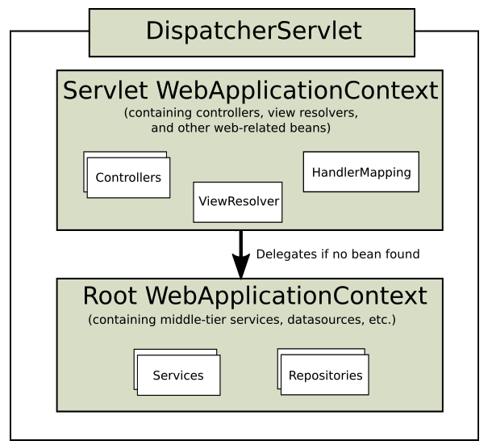
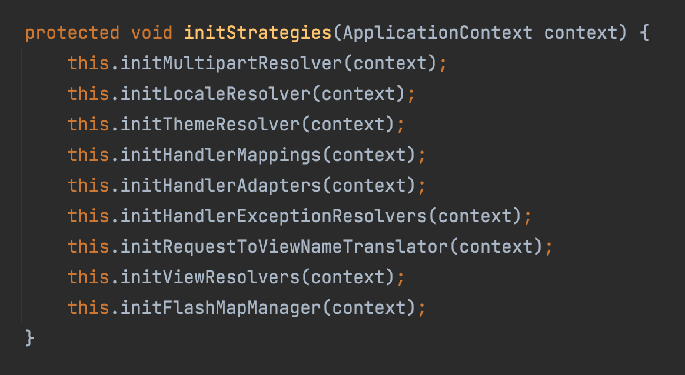
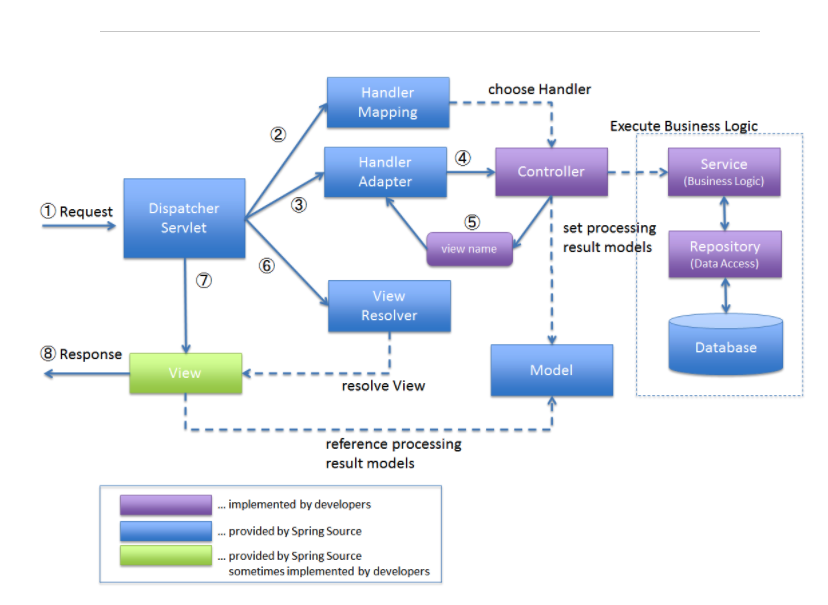
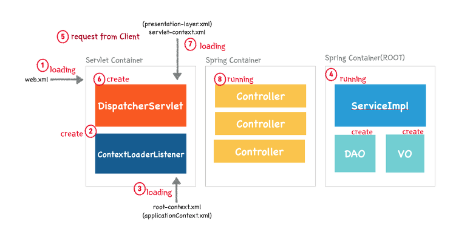
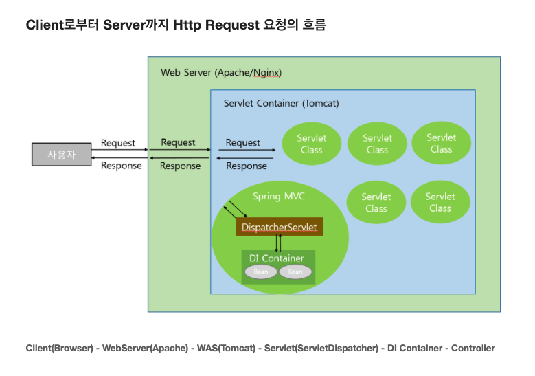

## **DispatcherServlet**

클라이언트가 보낸 요청을 받아서 공통적인 작업을 먼저 수행한 후에 적절한 세부 컨트롤러로 작업을 위임해주고, 클라이언트에게 보낼 뷰를 선택해서 최종 결과를 생성하는 등의 작업을 수행한다.

**HandlerMapping** : URL을 기준으로 어떤 컨트롤러를 사용할지 결정한다.

**HandlerAdapter** : 컨트롤러의 메서드를 호출하는 역할을 한다. Interceptor가 있을 때는 Interceptor의 preHandle() 메서드를 실행한 다음 컨트롤러의 메서드를 호출하여 요청을 처리한다.

**ViewResolver** : 컨트롤러가 리턴한 뷰 이름을 참고해서 적절한 뷰를 결정한다. 매핑되는 View 객체를 DispatcherServlet에 전달한다.

**HandlerExceptionResolver** : 예외가 발생했을 때, 이를 처리하는 로직을 갖고 있다. 예외가 발생했을 때 예외의 종류에 따라 에러 페이지를 표시한다거나, 관리자에게 통보해주는 등의 작업은 컨트롤러가 아니라 DispatcherServlet을 통해 처리된다.

**Root WebApplicationContext** (ApplicationContext)

- 여러 Servlet에서 공유해서 사용할 Bean을 등록(선언)하는 Context
- 웹 기술에서 완전히 독립적인 비즈니스 서비스 계층과 데이터 액세스 계층을 담고 있다.
- Service, Repository 등
- Application 전역에서 사용 가능한 WebApplicationContext

**Servlet WebApplicationContext** (ServletContext)

- 서블릿 단위로 생성되는 Context
- 서불릿 생성 시에 필요한 설정 정보를 담고 있다.
- 서블릿 컨테이너 실행 시 생성되고 컨테이너 종료 시 소멸된다.
- 스프링 웹 기술을 기반으로 동작하는 웹 관련 빈을 담고 있다.
- Controller, ViewResolver 등
- Servlet에서만 사용 가능한 WebApplicationContext

서블릿(자식) 컨텍스트가 루트(부모) 컨텍스트를 참조하는 관계. 그 반대의 경우는 불가능하다. 클래스 상속 관계와 비슷하게 계층 관계로 연결된다.

**DIspatcherServlet 기본 세팅**

## Spring MVC 처리 흐름

1. DispatcherServlet의 HTTP 요청 접수

   - 모든 요청에 대해 공통적으로 진행해야 하는 전처리 작업 수행
   - 보안, 파라미터 조작, 한글 디코딩 등의 작업

2. DispatcherServlet에서 컨트롤러로 HTTP 요청 위임

   - URL, 파라미터 정보, HTTP 명령 등을 참고해서 어떤 컨트롤러에게 작업을 위임할지 결정

   - 컨트롤러 선정 - **핸들러 매핑** 전략 이용
     `HandlerMapping` : URL과 요청 정보를 기준으로 어떤 컨트롤러를 사용할 것인지를 결정하는 로직을 담당

   - 해당 컨트롤러의 메소드를 호출해서 실제로 웹 요청을 처리하는 작업을 위임
     어떤 컨트롤러 오브젝트의 메소드를 호출해야 하는지 어떻게 앎? -> **어댑터**
     `HandlerAdapter` : 핸들러 매핑으로 선택한 컨트롤러를 DispatcherServlet이 호출할 때 사용. 컨트롤러의 메소드를 호출하는 역할

   - 오브젝트 어댑터 패턴을 사용해서 해당 컨트롤러 타입을 지원하는 어댑터를 중간에 껴서 호출한다. 항상 일정한 방식으로 컨트롤러를 호출하고 결과를 받을 수 있다.

   - 각 어댑터는 자신이 담당하는 컨트롤러에 맞는 호출 방법을 이용해서 컨트롤러에 작업 요청을 보내고 결과를 돌려받아서 DispatcherServlet에게 다시 돌려준다. -> 하나의 DispatcherServlet이 동시에 여러가지 타입의 컨트롤러를 사용할 수 있다.

   - DispatcherServlet이 핸들러 어댑터에 웹 요청을 전달할 때는 모든 웹 요청 정보가 담긴 HttpServletRequest 타입의 오브젝트를 전달해준다.

   - 이를 어댑터가 적절히 변환해서 컨트롤러의 메소드가 받을 수 있는 파라미터로 변환해서 전달한다. HttpServletResponse도 함께 전달해준다.

3. 컨트롤러의 메서드들이 호출되어 모델 생성과 정보 등록

   - 먼저 사용자 요청을 해석
   - 그에 따라 실제 비즈니스 로직을 수행하도록 서비스 계층 오브젝트에게 작업을 위임
   - 결과를 받아서 모델을 생성, 모델에 정보를 넣어줌
   - 어떤 뷰를 사용할지 결정

4. 컨트롤러의 결과 리턴 : Model, View

   - 보통은 뷰의 논리적인 이름을 리턴해주면 DispatcherServlet의 전략인 ViewResolver가 이를 이용해 뷰 오브젝트를 생성해준다.
   - ModelAndView - DispatcherServlet이 최종적으로 어댑터를 통해 컨트롤러로부터 돌려받는 오브젝트
   - Model과 View를 넘기는 것이 컨트롤러 책임

5. DispatcherServlet의 View 호출과 Model 참조

   - DispatcherServlet이 컨트롤러로부터 Model과 View를 받은 후 전달받은 View 이름과 매칭되는 실제 View 파일을 찾기 위해 ViewResolver에게 요청. Model을 전달해주고 클라이언트에게 돌려줄 최종 결과물을 생성해달라고 요청
   - ViewResolver는 매핑되는 View 객체를 DispatcherServlet에 전달. 최종 결과물은 HttpServletResponse 안에 담기게 됨

6. HTTP 응답 돌려주기

   - DispatcherServlet은 등록된 후처리기가 있는지 확인하고, 있다면 후처리기에서 후속 작업을 진행한 뒤에 뷰가 만들어준 HttpServletResponse에 담긴 최종 결과를 서블릿 컨테이너에게 돌려준다.
   - 서블릿 컨테이너는 HttpServletResponse에 담긴 정보를 HTTP 응답으로 만들어 사용자의 브라우저나 클라이언트에게 전송하고 작업을 종료한다.

---

### 추가 개념

**HandlerMapping**

- RequestMappingHandlerMapping : 컴포넌트 스캔할 패키지를 지정해주면 패키지의 @Controller 중에 @RequestMapping에 선언된 URL과 해당 @Controller 클래스의 메소드와 매핑 (jdk1.5 이상&Spring 3.1이후 버전의 기본 HandlerMapping)

**Front-Controller Pattern**

- 모든 리소스(Resource) 요청을 처리해주는 하나의 컨트롤러(Controller)를 두는 패턴이다.
- MVC과 함께 사용한다.

**Front-Controller Pattern 장점**

- 모든 요청(Request)를 하나의 컨트롤러(Controller)를 통해 작업을 한 곳에서 수행할 수 있다.
- 추적(Tracking)이나 보안(Security)을 적용할 때 하나의 컨트롤러(Controller)에 하기 때문에 편하다.
- 파일 구조가 바뀌어도 URL을 유지할 수 있다.

**전체 구조 & 흐름**

### 참고

https://mossgreen.github.io/Servlet-Containers-and-Spring-Framework/

https://velog.io/@juejue/Web-Web-Server-vs-Web-Application-Server-%EC%9B%B9-%EC%84%9C%EB%B2%84%EC%99%80-%EC%9B%B9-%EC%96%B4%ED%94%8C%EB%A6%AC%EC%BC%80%EC%9D%B4%EC%85%98-%EC%84%9C%EB%B2%84

https://gmlwjd9405.github.io/2018/10/29/web-application-structure.html

https://nesoy.github.io/articles/2017-02/Front-Controller

https://javannspring.tistory.com/231

[오브젝트 어댑터 패턴](https://invincibletyphoon.tistory.com/20)